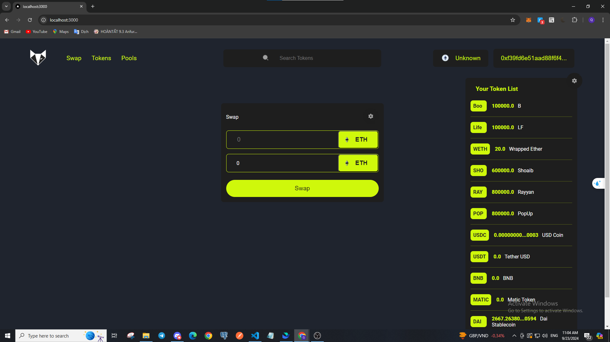
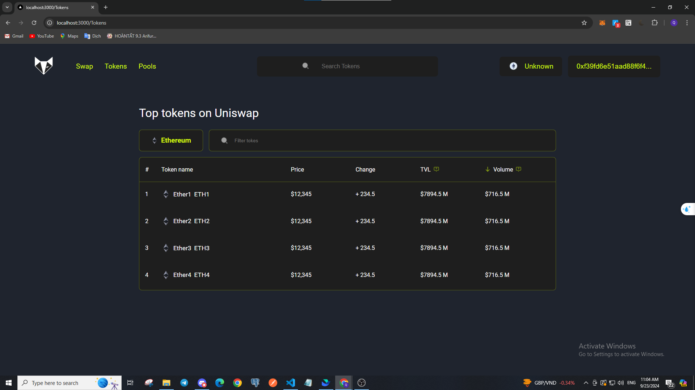
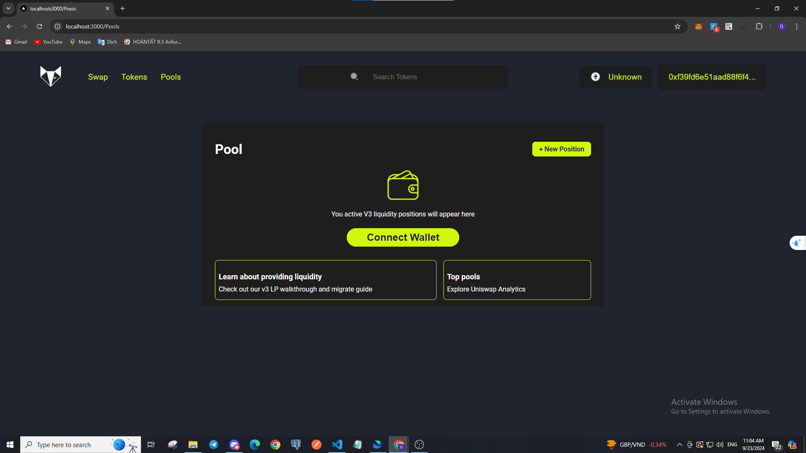
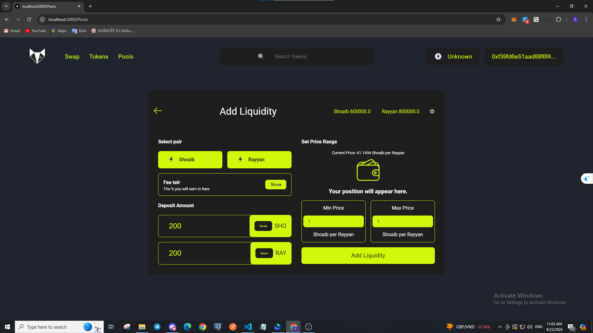

# Building and Deploying a Uniswap Exchange Clone for DeFi

Enter the world of decentralized finance (DeFi) with our Uniswap Exchange clone, UniClone. This project focuses on replicating the functionalities of the popular decentralized exchange Uniswap, providing users with a seamless and efficient platform for swapping tokens, providing liquidity, and earning fees.

UniClone leverages smart contracts and blockchain technology to enable trustless and permissionless token swaps directly from users' wallets. By replicating Uniswap's automated market maker (AMM) mechanism, our clone ensures liquidity for all listed tokens and allows users to trade without the need for traditional order books or centralized intermediaries.

## Project Overview

## Technology used in the Application

1.  HTML, CSS, and JavaScript.
2.  Next js.
3.  Hardhat.
4.  Ethers.js.
5.  Solidity.
6.  Alchemy Provider (connecting With the main net).
7.  Uniswap 3.
8.  ERC20.

## NetWork

Localhost 8545
 
http://localhost:8545
 
31337
 
ETH

## Instruction

npx hardhat clean
 
 
npx hardhat compile
 
 
npx hardhat node
 
 
npx hardhat run --network localhost scripts/deploy.js
 
 
npx hardhat run --network localhost scripts/uniswapContract.js
 
 
npx hardhat run --network localhost scripts/deployToken.js
 
 
npx hardhat run --network localhost scripts/deployPool.js
 
 
npx hardhat run --network localhost scripts/addLiquidity.js
 
 
npx hardhat run --network localhost scripts/checkLiquidity.js
 
 
npm run dev

# IMPORTANT INFO

# Deployed Address Factory

## Deploy :

Boo Toekn deployed to: 0xdccF554708B72d0fe9500cBfc1595cDBE3d66e5a
 
 
Life Token deployed to: 0x645B0f55268eF561176f3247D06d0b7742f79819
 
 
Single Swap Token deployed to: 0x5fe2f174fe51474Cd198939C96e7dB65983EA307
 
 
Swap Multi Hop deployed to: 0x8AFB0C54bAE39A5e56b984DF1C4b5702b2abf205
 
 
User Storage Data deployed to: 0x81ED8e0325B17A266B2aF225570679cfd635d0bb

## Uniswap Contract :

wethAddress= 0x6B763F54D260aFF608CbbAeD8721c96992eC24Db
 
 
factoryAddress= 0xF48883F2ae4C4bf4654f45997fE47D73daA4da07
 
 
swapRouterAddress= 0x226A19c076a3047a53e5430B14bcDB42dbccA159
 
 
nftDescriptorAddress= 0xA5c9020ea95324a05B48491FB3e61Ba111E5dd95
 
 
positionDescriptorAddress= 0x093D305366218D6d09bA10448922F10814b031dd
 
 
positionManagerAddress= 0x061FB3749C4eD5e3c2d28a284940093cfDFcBa20

## Deploy Token :

shoaibAddress= '0x6B763F54D260aFF608CbbAeD8721c96992eC24Db'
 
 
rayyanAddress= '0xF48883F2ae4C4bf4654f45997fE47D73daA4da07'
 
 
popupAddress= '0x226A19c076a3047a53e5430B14bcDB42dbccA159'

## Deploy Pool :

SHO_RAY= '0x90C780e95a2628dA0FcC006A21aa48F0a0AD7fFE'

# Address Unchanged

MAINNEXT TOKEN ADDRESS

"0xA0b86991c6218b36c1d19D4a2e9Eb0cE3606eB48",
 
"0xC02aaA39b223FE8D0A0e5C4F27eAD9083C756Cc2",
 
"0xdAC17F958D2ee523a2206206994597C13D831ec7",
 
"0xB8c77482e45F1F44dE1745F52C74426C631bDD52",
 
"0x7D1AfA7B718fb893dB30A3aBc0Cfc608AaCfeBB0",
 
"0x6B175474E89094C44Da98b954EedeAC495271d0F",
 
"0x95aD61b0a150d79219dCF64E1E6Cc01f0B64C4cE",
 
"0x4278C5d322aB92F1D876Dd7Bd9b44d1748b88af2",
 
"0x0D92d35D311E54aB8EEA0394d7E773Fc5144491a",
 
"0x24EcC5E6EaA700368B8FAC259d3fBD045f695A08",

ISwapRouter(0xE592427A0AEce92De3Edee1F18E0157C05861564);

TEST

const DAI = "0x6B175474E89094C44Da98b954EedeAC495271d0F";
 
const USDC = "0xA0b86991c6218b36c1d19D4a2e9Eb0cE3606eB48";
 
const DAI_WHALE = "0x97f991971a37D4Ca58064e6a98FC563F03A71E5c";
 
const USDC_WHALE = "0x97f991971a37D4Ca58064e6a98FC563F03A71E5c";

const WETH9 = "0xC02aaA39b223FE8D0A0e5C4F27eAD9083C756Cc2";

const qutorAddress = "0xb27308f9F90D607463bb33eA1BeBb41C27CE5AB6";

ETHERSCAN URL: `https://api.etherscan.io/api?module=contract&action=getabi&address=${address}&apikey=${ETHERSCAN_API_KEY}`;

V3_SWAP_ROUTER_ADDRESS = "0x68b3465833fb72A70ecDF485E0e4C7bD8665Fc45";

const name0 = "Wrapped Ether";
 
const symbol0 = "WETH";
 
const decimals0 = 18;
 
const address0 = "0xC02aaA39b223FE8D0A0e5C4F27eAD9083C756Cc2";

const name1 = "DAI";
 
const symbol1 = "DAI";
 
const decimals1 = 18;
 
const address1 = "0x6B175474E89094C44Da98b954EedeAC495271d0F";

# Project demo video

## DEX Project:

### Swap:

### List:

### Pool:

### Swap Token:

